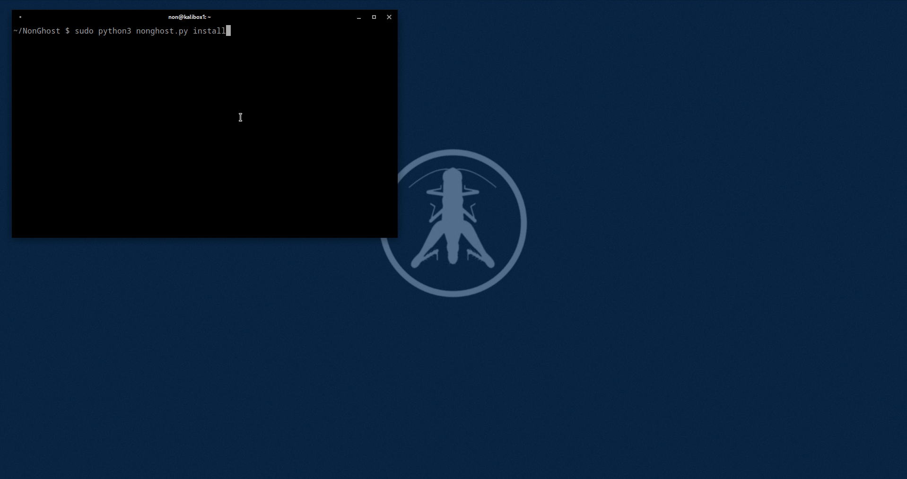

# NonGhost



### Description
NonGhost redirects all internet traffic through TOR.
Essentially, it's TorGhost but recreated by a grasshopper.
The original TorGhost can be found [here](https://github.com/SusmithKrishnan/torghost)

NonGhost is built for Kali but it should run on other Debian systems fine.
Keep in mind that you need root privileges to run NonGhost.

### Installation
First clone the repo
```git clone https://github.com/n0ns0n/nonghost && cd nonghost```

Before the first run of NonGhost, execute (with sudo) on a terminal:
```sudo python3 nonghost.py install```

#### Available modes
```BASH
sudo python3 nonghost.py stop    # Stop NonGhost
sudo python3 nonghost.py start   # Start NonGhost
sudo python3 nonghost.py switch  # New tor exit node
sudo python3 nonghost.py install # Install NonGhost
```
